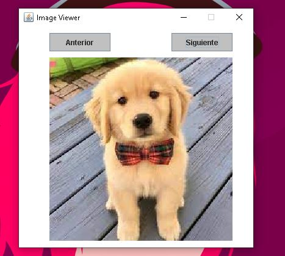
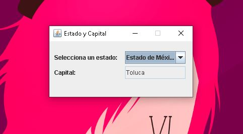

# Programacion Movil 1

## Proyecto 1 Calculadora Java  

 Usamos JavaSwing para los componentes visuales y ScriptEngine para evaluar las expresiones

Video de prueba:
https://youtu.be/Sz0dDCULQyU

## Proyecto 2 Cronometro Java  

 Usamos JavaSwing para los componentes visuales y un Timer para darle delay a los cambios de los valores

Video de prueba:
https://youtu.be/U4o17_22WMY

## Proyecto 3 Basic Drawing Panel Java 

 Usamos JavaSwing crear un pequeño panel de dibujo y mediante eventos controlamos el grosor, color o modo borrar.

Video de prueba:
https://youtu.be/Ohdgwo4Cptw

## Proyecto 4 Galeria de imagenes 

 Usamos JavaSwing para hacer un panel que puede cambiar de imagen

Video de prueba:
https://youtu.be/D2WeljNc3Gs

## Proyecto 5 Peluqueria de perros

 Creamos una peluqueria de perros con el enfoque orientado a objetos.

## Proyecto 6 Capitales de México

 Usamos JavaSwing para hacer un pequeño script que muestre la capital de un estado de la republica al ser seleccionado.

Video de prueba:
https://youtu.be/zTSI2weljPA
