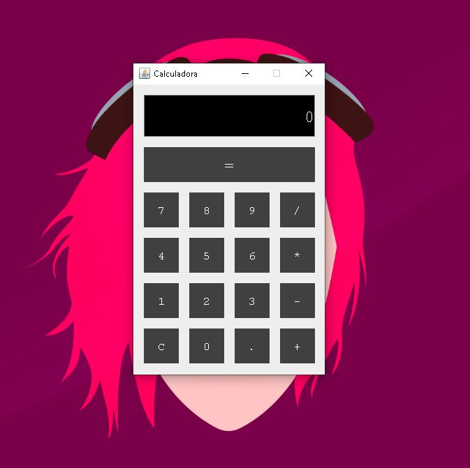
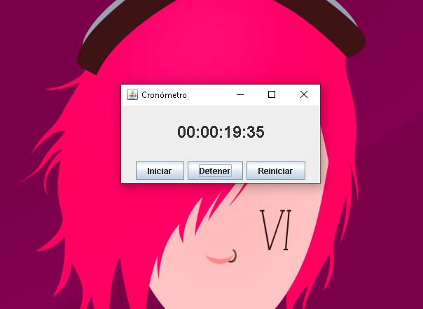
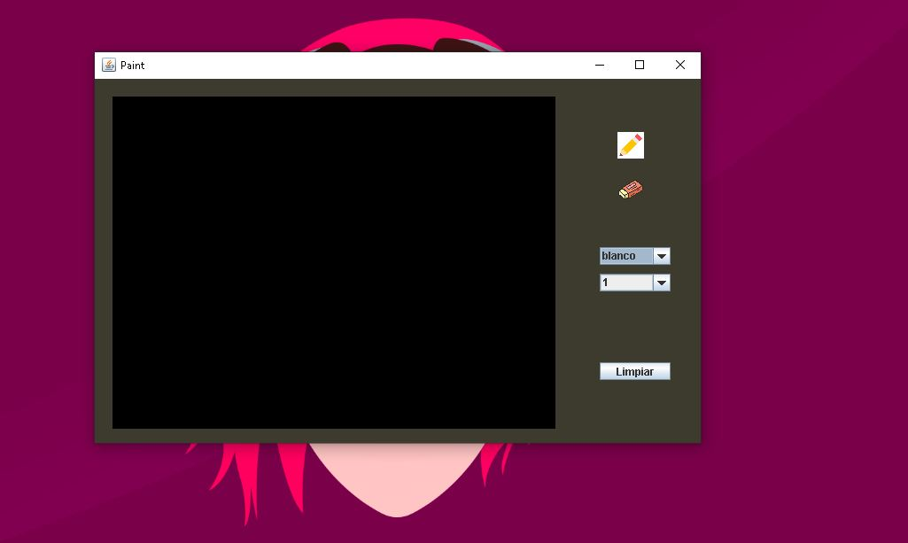

# Programacion Movil 1

## Proyecto 1 Calculadora Java  

 Usamos JavaSwing para los componentes visuales y ScriptEngine para evaluar las expresiones

Video de prueba:
https://youtu.be/Sz0dDCULQyU

## Proyecto 2 Cronometro Java  

 Usamos JavaSwing para los componentes visuales y un Timer para darle delay a los cambios de los valores

## Proyecto 3 Basic Drawing Panel Java 

 Usamos JavaSwing crear un pequeño panel de dibujo con java swing y mediante eventos controlamos el grosor, color o modo borrar.

Video de prueba:
https://youtu.be/Ohdgwo4Cptw

